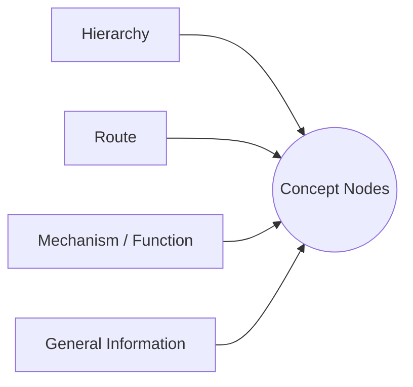

# Atlas — Product Requirements Document

## 1. Product Overview

### Product Name

**Atlas** (working name)

Alternative names:

- MedGraph
- Cortex
- LayerMind
- AnatomyMind
- MentalMap

### Product Type

Web-based visual medical knowledge-map authoring platform.

### Current Product Scope

Atlas currently focuses exclusively on the **authoring experience**.

An author can:

1. Create an organ.
2. Open that organ in one unified editor.
3. Add visual layers.
4. Upload one image to each layer.
5. Mark concepts on an image using pins or rectangles.
6. Add and edit knowledge associated with those concepts.
7. Connect concepts using relationships, reasoning paths, and hyperedges.
8. Support reasoning paths and hyperedges with evidence and confidence.
9. Overlay visual layers to compare structures, views, or states.

Student-facing exploration, assessment, simulation, and collaboration are not
part of the current product.

---

## 2. Vision

Atlas enables medical educators to turn disconnected medical facts into visual,
connected mental models.

Instead of authoring anatomy, histology, physiology, pathology, and clinical
reasoning as separate collections of notes, an educator can place those forms of
knowledge in a shared visual and conceptual workspace.

The resulting map should make it possible to explain:

- **What** a structure, state, or concept is.
- **How** a process, route, or mechanism works.
- **Why** one event causes or explains another.
- **What changes** between visual states or layers.

Atlas should feel like a visual medical authoring environment—not a generic
diagramming tool, note-taking application, or database administration panel.

---

## 3. Problem Statement

Medical education contains thousands of facts spanning:

- gross anatomy
- histology
- physiology
- pathology
- symptoms
- investigations
- treatments
- clinical reasoning

These facts are commonly authored and taught in isolation. This fragmentation
makes it difficult to represent:

- structural hierarchy
- routes and flows
- physiological mechanisms
- causal chains
- disease progression
- changes between normal and abnormal states
- the evidence supporting an explanation

Existing products often specialize in one form of representation, such as
flashcards, notes, concept maps, or anatomy atlases. They rarely combine
image-based annotation, layered visual states, knowledge graphs, multi-concept
relationships, and causal reasoning in one authoring workflow.

---

## 4. Goals

Atlas must allow an author to:

- create and manage organ-based knowledge maps
- work inside one unified editor per organ
- create multiple image-based visual layers
- annotate images quickly with pins and rectangles
- create layer-specific concept nodes
- organize node knowledge through four knowledge lenses
- create relationships within and across visual layers
- build ordered reasoning paths
- create hyperedges involving multiple concept nodes
- add evidence and confidence to reasoning paths and hyperedges
- compare layers using synchronized overlays
- save, reopen, and continue editing without losing work

### Non-Goals

The current product does not include:

- student-facing pages or modes
- quizzes or assessments
- course, class, or cohort management
- student and educator role systems
- AI-assisted content generation
- automatic image segmentation
- disease simulation
- “what if” reasoning
- collaborative editing
- publishing or public sharing
- version history

These capabilities may be considered later, but they must not add complexity to
the current authoring workflow.

---

## 5. Target User

### Primary User

Medical knowledge-map authors, including:

- professors
- teaching assistants
- medical tutors
- course creators
- subject-matter experts

### User Need

The author needs to represent complex medical knowledge visually without
switching among separate tools for image annotation, concept mapping, pathway
construction, and evidence management.

---

## 6. Product Mental Model

The product uses the following high-level structure:

```text
Organ
├── Visual Layers
│   ├── One Image per Layer
│   ├── Pins and Rectangles
│   └── Layer-Specific Concept Nodes
├── Relationships
├── Reasoning Paths
├── Hyperedges
└── Evidence and Confidence
```

Examples:

```text
Heart
├── Normal
├── Hypertrophy
├── Heart Failure
└── Cardiogenic Shock
```

```text
Skin
├── Gross Anatomy
├── Histology
└── Pathology
```

### Shared Concept Space

All concept nodes within an organ are available in the organ’s shared authoring
space. This allows relationships, reasoning paths, and hyperedges to reference
nodes from different visual layers.

However, nodes remain **layer-specific records**. A node does not automatically
persist across layers, and two visually corresponding concepts in different
layers are separate nodes unless the author explicitly connects them.

---

## 7. Visual Layers and Knowledge Lenses

Atlas must distinguish clearly between **visual layers** and **knowledge
lenses**. They are different concepts and must not be implemented as the same
entity.

### 7.1 Visual Layer

A visual layer is an image-based view, modality, or state of an organ.

Examples:

- Normal Heart
- Hypertrophied Heart
- Dilated Cardiomyopathy
- Gross Anatomy
- Histology
- Pathology

Each visual layer:

- belongs to one organ
- has zero or one image
- contains pins and rectangles
- contains layer-specific concept nodes through those annotations
- can be selected as the active editable layer
- can be shown or hidden
- has adjustable opacity
- can be reordered
- can be cloned
- can be aligned with other layers

### 7.2 Knowledge Lens

A knowledge lens is a way to author, organize, and inspect information associated
with concept nodes.

Atlas has four knowledge lenses:

1. **Hierarchy**
2. **Route**
3. **Mechanism / Function**
4. **General Information**

Knowledge lenses:

- do not contain separate images
- do not create duplicate visual layers
- do not cause nodes to be copied
- operate on the organ’s shared concept space
- can be selected as filters or editing contexts within the same editor

The conceptual relationship is:



---

## 8. Core Concepts

### 8.1 Organ

An organ is the top-level authoring project.

Examples:

- Heart
- Kidney
- Lung
- Brain
- Skin

An organ contains all visual layers, nodes, relationships, reasoning paths,
hyperedges, and supporting evidence for that knowledge map.

An organ should support:

- name
- optional description
- optional thumbnail
- creation timestamp
- last-edited timestamp

The author can create, open, rename, duplicate, and delete an organ.

### 8.2 Visual Layer

A visual layer represents one visual snapshot of an organ.

It should support:

- name
- optional description
- order
- visibility
- opacity
- active/editable status
- alignment settings
- optional image

Only one layer can be the active editable layer at a time.

### 8.3 Image

Each visual layer can have no more than one image.

Supported formats:

- PNG
- JPG/JPEG
- WEBP
- SVG

The author can:

- upload an image
- replace an image
- remove an image
- fit it to the canvas
- zoom and pan
- align it with other visible layers

Replacing or removing an image must warn the author when existing annotations
could become misaligned.

### 8.4 Annotation

An annotation is a visual anchor placed on a layer’s image.

Current annotation types:

- **Pin:** marks a specific point.
- **Rectangle:** marks a bounded region.

Each annotation:

- belongs to one visual layer
- is positioned relative to that layer’s image
- references one concept node
- can be selected, moved, edited, and deleted
- remains aligned after zooming, resizing, and reopening the editor

Polygon annotations are outside the current scope.

### 8.5 Concept Node

A concept node is a layer-specific unit of medical knowledge.

Examples:

- Left Ventricle
- Mitral Valve
- Reduced Contractility
- Pulmonary Edema
- Myocardial Fibrosis

A node should support:

- title (required for creation)
- canonical name
- category
- aliases
- short definition
- detailed explanation
- general information
- anatomical location
- editor comment
- relations (incoming and outgoing linked relationships)
- suggested trails (reasoning path & trail recommendations)
- tags
- authoring status
- associated annotation
- owning visual layer

Only the title is required for initial creation. The author can complete the
remaining information later.

### 8.6 Relationship

A relationship is a directed connection between two concept nodes.

Relationships may connect:

- two nodes in the same visual layer
- nodes in different visual layers

A relationship should support:

- source node
- target node
- relationship type
- knowledge lens
- optional label
- optional explanation

#### Hierarchy Relationships

Used to represent structural organization:

```text
PART_OF
CONTAINS
ADJACENT_TO
```

#### Route Relationships

Used to represent movement, flow, drainage, supply, or innervation:

```text
FLOWS_TO
DRAINS_TO
SUPPLIES
INNERVATES
```

#### Mechanism / Function Relationships

Used to represent function, causation, or explanation:

```text
CAUSES
LEADS_TO
RESULTS_IN
PREVENTS
MECHANISM_OF
EXPLAINS
```

#### State Relationships

Used primarily for cross-layer change:

```text
EVOLVES_TO
WORSENS_TO
IMPROVES_TO
```

Example:

```text
Normal Left Ventricle
EVOLVES_TO
Dilated Left Ventricle
```

State relationships remain available in the shared concept space and may be
presented as a cross-layer relationship category rather than a fifth knowledge
lens.

### 8.7 General Information

General Information is a knowledge lens for facts that do not naturally require
an edge between nodes.

Examples:

- definition
- appearance
- histological description
- clinical relevance
- common variation
- notes
- tags

General information is edited directly on the concept node.

### 8.8 Reasoning Path

A reasoning path is a named, ordered chain that explains how or why something
happens.

Example:

```text
Hypertension
→ Left Ventricular Hypertrophy
→ Myocardial Fibrosis
→ Reduced Compliance
→ Heart Failure
```

A reasoning path:

- belongs to one organ
- can reference nodes from one or more visual layers
- contains at least two ordered node steps when complete
- may reference relationships between consecutive nodes
- can include an explanation for each transition
- can be highlighted and previewed in the editor
- can have supporting evidence and confidence

### 8.9 Hyperedge

A hyperedge represents one meaningful relationship involving multiple concept
nodes. It must not be reduced to duplicated pairwise relationships when the
meaning applies to the group as a whole.

Example:

```text
Reduced Contractility
+ Increased End-Systolic Volume
+ Neurohormonal Activation
→ Heart Failure Progression
```

A hyperedge:

- belongs to one organ
- contains at least two member nodes
- can reference nodes from one or more visual layers
- may identify one or more outcome nodes
- has a name, type, and explanation
- can be highlighted and edited inside the unified editor
- can have supporting evidence and confidence

Its visual representation should make group membership clear without showing a
confusing collection of artificial pairwise edges.

### 8.10 Evidence and Confidence

Evidence and confidence support the author’s reasoning claims.

They can be attached to:

- reasoning paths
- hyperedges

An evidence item should support:

- citation or source title
- optional URL
- optional notes
- confidence level
- optional confidence explanation

Confidence levels:

- Low
- Medium
- High

Multiple evidence items may support the same reasoning path or hyperedge.
Confidence must not be displayed without allowing the author to explain or
support the judgment.

---

## 9. Information Architecture

Atlas currently has two primary screens:

```text
Organ Dashboard
└── Unified Organ Editor
```

There are no separate management pages for layers, nodes, relationships,
reasoning paths, hyperedges, or evidence.

### 9.1 Organ Dashboard

The dashboard is the main page of the product.

It allows the author to:

- view existing organs
- create an organ
- open an organ
- rename an organ
- duplicate an organ
- delete an organ
- see when an organ was last edited

The dashboard should prioritize organ projects and avoid unrelated statistics or
administrative widgets.

### 9.2 Unified Organ Editor

Opening an organ leads to one editor where all authoring occurs.

Recommended layout:

```text
┌───────────────────────────────────────────────────────────────┐
│ Back | Organ | Tools | Undo/Redo | Save Status               │
├──────────────┬─────────────────────────────┬──────────────────┤
│ Visual       │                             │ Inspector        │
│ Layers       │        Image Canvas         │                  │
│              │                             │ Selected entity  │
│ Visibility   │                             │ and its fields   │
│ Opacity      │                             │                  │
├──────────────┴─────────────────────────────┴──────────────────┤
│ Nodes | Relationships | Paths | Hyperedges | Evidence         │
└───────────────────────────────────────────────────────────────┘
```

The bottom knowledge panel may be collapsible or implemented using tabs.

Routine editing should happen in the contextual inspector. Modal dialogs should
be reserved for creation, destructive confirmation, and tasks that require
focused multi-node selection.

---

## 10. Authoring Workflow

### Step 1: Create or Open an Organ

The author creates an organ from the dashboard or opens an existing one.

### Step 2: Create a Visual Layer

The author creates an empty layer or clones an existing layer.

### Step 3: Upload an Image

The author uploads one image to the active layer.

### Step 4: Create an Annotation

The author selects the Pin or Rectangle tool and marks a structure or region on
the image.

### Step 5: Create a Concept Node

The annotation opens a node editor. The author enters at least a title, then can
add definitions, explanations, tags, and general information.

### Step 6: Add Knowledge

The author uses the Hierarchy, Route, Mechanism / Function, or General
Information lens to add and inspect knowledge associated with concept nodes.

### Step 7: Connect Nodes

The author creates same-layer or cross-layer relationships between nodes.

### Step 8: Build Reasoning Structures

The author creates:

- ordered reasoning paths
- multi-node hyperedges

### Step 9: Add Evidence and Confidence

The author supports reasoning paths and hyperedges with sources, notes, and
confidence.

### Step 10: Save and Continue

All changes persist. The author can leave, reopen the organ, and continue
editing from the saved state.

---

## 11. Layer Creation

### Empty Layer

Creates a new independent layer with:

- name
- optional description
- no image
- no annotations
- no nodes

### Clone Layer

Copies:

- layer metadata
- image reference or image copy, depending on storage design
- pins
- rectangles
- concept nodes
- applicable relationships within the source layer

All mutable cloned entities receive new identifiers. Relationships in the clone
must reference the cloned nodes.

Editing or deleting the clone must not mutate the source layer, and editing or
deleting the source must not mutate the clone.

Cloning should be recommended when an organ already has at least one layer.

---

## 12. Onion Layer System

The editor allows multiple visual layers to be viewed simultaneously.

Default presentation:

```text
Active Layer = 100% opacity
Other Visible Layers = 30% opacity
```

The author can:

- show or hide each layer
- adjust each layer’s opacity
- choose the active editable layer
- isolate one layer
- lock a layer
- reorder layers
- align one layer with another

Zoom and pan remain synchronized across visible layers.

The active editable layer must always be unmistakable. New annotations are
created only on that layer.

When layer images have different dimensions or alignment, the editor should
support:

- center alignment
- fit alignment
- manual position adjustment
- manual scale adjustment
- alignment reset

---

## 13. Editor Tools and Interactions

Required editor modes:

- Select
- Pan
- Add Pin
- Add Rectangle
- Add Relationship
- Build Reasoning Path
- Build Hyperedge

The active mode must always be visible.

Pressing `Escape` cancels the current action and returns to Select mode.

The editor should support:

- zoom
- pan
- fit to screen
- reset view
- selection
- moving pins
- moving and resizing rectangles
- deleting selected items
- undo and redo
- visible save status

Dragging to pan must not accidentally create an annotation. Selecting one entity
must not trigger multiple editing tools.

Recommended keyboard shortcuts:

```text
V = Select
H or Space = Pan
P = Pin
R = Rectangle
E = Relationship
Delete/Backspace = Delete Selection
Escape = Cancel
Ctrl/Cmd + Z = Undo
Ctrl/Cmd + Shift + Z = Redo
```

---

## 14. Functional Requirements

### Organ Management

- Create an organ.
- Open an organ.
- Rename an organ.
- Duplicate an organ.
- Delete an organ with confirmation.
- Display last-edited information.

### Layer Management

- Create an empty layer.
- Clone an existing layer.
- Rename, reorder, and delete a layer.
- Select the active layer.
- Control layer visibility and opacity.
- Lock and isolate a layer.

### Image Management

- Upload, replace, and remove one image per layer.
- Validate supported file formats.
- Show upload progress and errors.
- Preserve annotation alignment.

### Annotation Management

- Create pins and rectangles.
- Select, move, resize, and delete annotations.
- Attach exactly one concept node to each annotation.
- Store coordinates relative to image dimensions rather than screen pixels.

### Concept Node Management

- Create a node quickly using only a title.
- Edit definitions, explanations, tags, and general information.
- Display the node’s owning visual layer.
- Delete a node safely.

### Relationship Management

- Connect two nodes.
- Choose a relationship type and knowledge lens.
- Add an optional label and explanation.
- Create same-layer and cross-layer relationships.
- Inspect incoming and outgoing relationships.
- Edit and delete relationships.

### Reasoning Path Management

- Create, name, edit, preview, and delete a path.
- Add and reorder node steps.
- Explain transitions.
- Highlight the path in the editor.

### Hyperedge Management

- Create, name, edit, highlight, and delete a hyperedge.
- Add at least two member nodes.
- Add optional outcome nodes.
- Reference nodes from multiple visual layers.

### Evidence and Confidence Management

- Add multiple evidence items to a reasoning path or hyperedge.
- Edit and delete evidence.
- Set and explain confidence.
- Make the supported target unambiguous.

### Persistence

- Persist every meaningful authoring action.
- Show Saving, Saved, Unsaved, and Failed states.
- Preserve data after refresh and reopening.
- Prevent silent data loss.

---

## 15. Validation and Referential Integrity

Atlas must not leave broken references.

Before deleting a node, the system must identify its use in:

- relationships
- cross-layer relationships
- reasoning paths
- hyperedges

The author must see the effect of deletion before confirming it.

The system must prevent:

- relationships with missing source or target nodes
- reasoning paths with missing steps
- completed reasoning paths with fewer than two nodes
- hyperedges with fewer than two member nodes
- evidence pointing to deleted targets
- annotations pointing to deleted nodes
- cloned relationships pointing to source-layer nodes unintentionally

Deleting an organ must clearly state that all of its layers, images,
annotations, nodes, relationships, paths, hyperedges, and evidence will also be
deleted.

---

## 16. Empty, Loading, and Error States

### No Organs

```text
Create your first organ to begin building a visual mental model.
```

### Organ With No Layers

```text
Add a visual layer to begin.
```

### Layer With No Image

```text
Upload an image to this layer.
```

### Image With No Concepts

```text
Use the Pin or Rectangle tool to mark your first concept.
```

### No Relationships

```text
Connect two concept nodes to describe how they relate.
```

### No Reasoning Paths

```text
Create an ordered path to explain how or why something happens.
```

### No Hyperedges

```text
Group multiple concept nodes into a shared relationship.
```

All asynchronous operations must provide visible progress, success, error, and
retry states where appropriate.

---

## 17. UX Principles

### One Organ, One Editor

All content belonging to an organ is authored in one unified workspace.

### Canvas First

The medical image and its annotations are the center of the experience. Panels
must support the canvas rather than crowd it.

### Direct Manipulation

Authors should create, select, move, resize, and connect entities directly
whenever practical.

### Fast Concept Creation

Creating the first node should require only a title. Detailed fields can be
completed later.

### Explicit Context

The active visual layer, knowledge lens, editor tool, current selection, and save
status must always be clear.

### Safe Editing

Destructive actions communicate their consequences. Undo and redo should cover
common canvas editing actions.

### Minimal Navigation

Routine authoring must not require navigating to separate CRUD pages.

---

## 18. Accessibility

The editor should provide:

- keyboard-accessible controls
- visible focus states
- accessible control names
- sufficient text and control contrast
- non-color indicators for relationship categories
- reduced-motion support
- textual lists of nodes, relationships, paths, and hyperedges
- keyboard alternatives for important canvas actions where practical

Graph meaning must not depend on color alone.

---

## 19. Success Metrics

### Discoverability and Speed

- Create and open the first organ in under 60 seconds.
- Create the first visual layer in under 60 seconds.
- Upload a layer image and create the first node in under 5 minutes.
- Create an additional node in under 30 seconds.
- Clone a layer in under 10 seconds.
- Find any node in the current organ within three interactions.

### Reliability

- Saved work remains intact after refresh and reopening.
- Annotations remain correctly aligned after viewport resizing.
- Cloned layers can be edited independently.
- No completed relationship, reasoning path, or hyperedge contains broken node
  references.

### Workflow Completion

An author can complete this flow without technical intervention:

```text
Create Organ
→ Add Layer
→ Upload Image
→ Add Concepts
→ Connect Nodes
→ Create Reasoning Path or Hyperedge
→ Add Evidence
→ Save
→ Reopen and Continue Editing
```

---

## 20. Acceptance Criteria

The current Atlas product is complete when:

- the main page allows organs to be created, opened, renamed, duplicated, and
  deleted
- opening an organ leads to one unified editor
- layers are created and managed inside that editor
- each layer accepts no more than one image
- pins and rectangles can be created and edited on the image
- every annotation references a layer-specific concept node
- visual layers and knowledge lenses are treated as separate concepts
- Hierarchy, Route, Mechanism / Function, and General Information can be added
  and edited
- relationships can connect nodes within and across layers
- reasoning paths can be created, reordered, explained, highlighted, and edited
- hyperedges can group multiple nodes without being reduced to pairwise edges
- evidence and confidence can be attached to reasoning paths and hyperedges
- onion-layer visibility, opacity, alignment, zoom, and pan work predictably
- cloning produces independent layers, annotations, nodes, and relationships
- all content persists after refresh and reopening
- invalid references are prevented or safely repaired during deletion
- empty, loading, save, error, and retry states are present
- no required feature ends in a non-functional or disconnected workflow
- no student-facing functionality is included

---

## 21. Future Considerations

Future capabilities may include:

- student exploration experiences
- AI-assisted node generation
- AI-assisted graph building
- automatic image segmentation
- polygon annotations
- quizzes and assessments
- graph search
- disease simulation
- “what if” reasoning
- collaborative editing
- version history
- publishing and sharing

These considerations are not requirements for the current authoring product.
